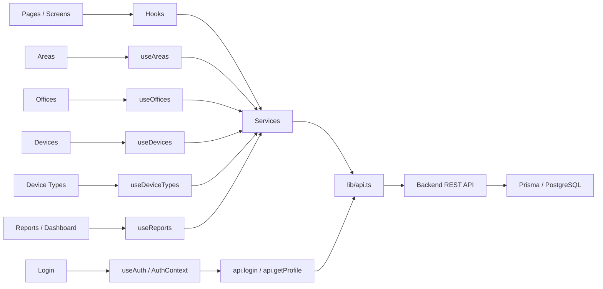

# SGDT Frontend

Frontend en React + Vite para el Sistema de Gestión de Dispositivos y Telecomunicaciones.

## Instalación

1. Instala dependencias:

```bash
npm install
```

2. Inicia el frontend:

```bash
npm run dev
```

3. Asegúrate de que el backend esté corriendo en `http://localhost:3000`.

## Flujo de consumo de servicios



## Estructura de consumo

- Las pages renderizan UI y formularios.
- Los hooks encapsulan carga, estado y CRUD.
- Los services llaman a `src/lib/api.ts`.
- `src/lib/api.ts` usa `axios` contra `http://localhost:3000/api`.
- El backend responde con datos reales desde Prisma.

## Imágenes referenciales

Para que una imagen se vea en la tabla y también se imprima en el PDF, debe estar disponible por URL pública.

La ruta recomendada es el backend:

```text
http://localhost:3000/uploads/brother-mfc-t930dw.jpg
```

Eso permite guardar la URL en `imageUrl` y usarla tanto en pantalla como en el PDF.
